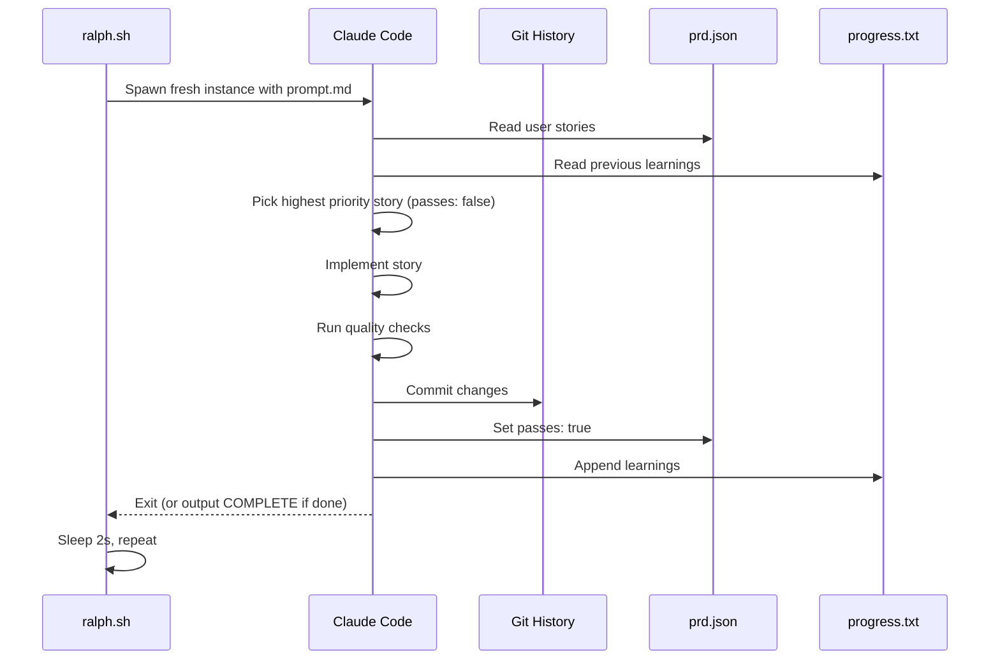
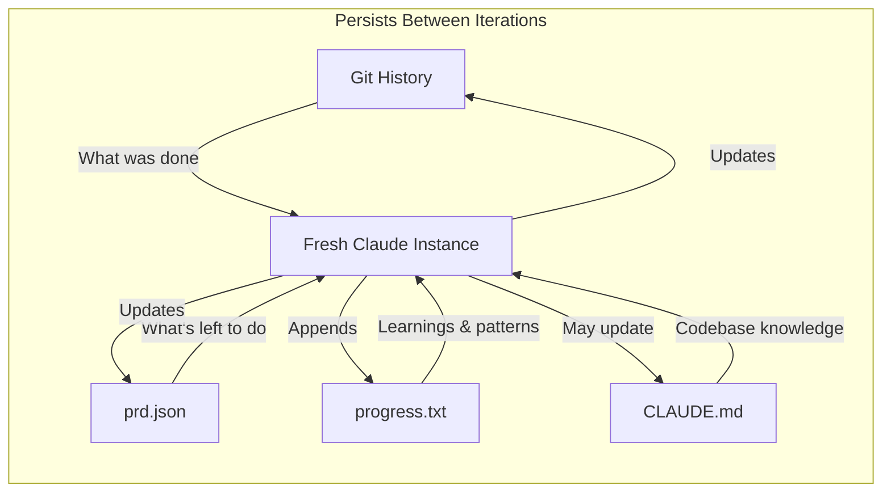
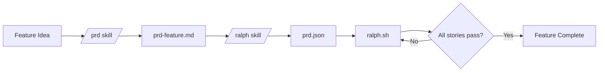
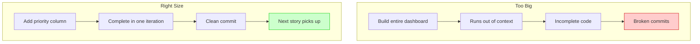

# Ralph


> "Ralph is a Bash loop." — [Geoffrey Huntley](https://ghuntley.com/ralph/), creator of the Ralph pattern

**The original, PRD-driven Ralph implementation for Claude Code.** Converted from [Ryan Carson's Amp version](https://x.com/ryancarson/status/2008548371712135632) to work with Claude Code CLI.

This is **not** the built-in Claude Code ralph skill. This is a customizable, transparent implementation that gives you full control over the autonomous loop — the way Geoffrey Huntley intended.

## Why This Over the Built-in Skill?

Geoffrey Huntley [explicitly stated](https://www.youtube.com/watch?v=O2bBWDoxO4s) that **"Claude Code's implementation isn't it."** Here's why this repo exists:

```mermaid
flowchart TB
    subgraph builtin["Built-in Ralph Skill"]
        B1[Single Claude Code Session] --> B2[Stop Hook Blocks Exit]
        B2 --> B3[Same Context Grows]
        B3 --> B4[Context Eventually Fills]
        B4 --> B5[Quality Degrades]
    end

    subgraph thisrepo["This Repo: PRD-Driven Ralph"]
        R1[Bash Loop Spawns Instance] --> R2[Fresh Context Every Time]
        R2 --> R3[Implement ONE Story]
        R3 --> R4[Commit + Update prd.json]
        R4 --> R5[Instance Exits Cleanly]
        R5 --> R1
    end

    style builtin fill:#ffcccc,stroke:#cc0000
    style thisrepo fill:#ccffcc,stroke:#00cc00
```



### The Critical Difference: Fresh Context

| Aspect | Built-in Skill | This Repo |
|--------|---------------|-----------|
| **Context per iteration** | Accumulates (same session) | Fresh (new instance) |
| **Memory model** | In-context (degrades over time) | External files (git, prd.json, progress.txt) |
| **Stop condition** | Hook blocks exit | `<promise>COMPLETE</promise>` signal |
| **Task structure** | Unstructured prompt | PRD with acceptance criteria |
| **Customization** | Limited | Full control via `prompt.md` |
| **Progress visibility** | Opaque | `progress.txt` + `prd.json` status |
| **Learning persistence** | Lost when session ends | Saved to `CLAUDE.md` files |

## How It Works



### The Memory Model

Unlike the built-in skill which relies on accumulated context, this implementation uses **external memory**:



## Prerequisites

- [Claude Code CLI](https://docs.anthropic.com/en/docs/claude-code) installed and authenticated
- `jq` installed (`brew install jq` on macOS)
- A git repository for your project

## Quick Start

### 1. Copy to your project

```bash
mkdir -p scripts/ralph
curl -sL https://raw.githubusercontent.com/snarktank/ralph/main/ralph.sh > scripts/ralph/ralph.sh
curl -sL https://raw.githubusercontent.com/snarktank/ralph/main/prompt.md > scripts/ralph/prompt.md
chmod +x scripts/ralph/ralph.sh
```

### 2. Create a prd.json

```json
{
  "project": "MyApp",
  "branchName": "ralph/my-feature",
  "description": "Add user authentication",
  "userStories": [
    {
      "id": "US-001",
      "title": "Add users table",
      "description": "As a developer, I need a users table to store credentials.",
      "acceptanceCriteria": [
        "Create users table with id, email, password_hash",
        "Add migration file",
        "Typecheck passes"
      ],
      "priority": 1,
      "passes": false,
      "notes": ""
    }
  ]
}
```

### 3. Run Ralph

```bash
./scripts/ralph/ralph.sh 10  # Run up to 10 iterations
```

Ralph will autonomously implement each story, commit changes, and mark stories as complete.

## What You Control (That the Built-in Doesn't)

### 1. The Prompt (`prompt.md`)

Every instruction Ralph follows is in `prompt.md`. Want to add project-specific rules? Edit the file:

```markdown
## Quality Requirements

- ALL commits must pass `npm run typecheck`
- Run `npm test` before committing
- Never modify files in `src/legacy/`
```

### 2. Story Granularity (`prd.json`)

You define exactly what "done" looks like for each story:

```json
{
  "acceptanceCriteria": [
    "Add loading spinner during API calls",
    "Show error toast on failure",
    "Typecheck passes",
    "Verify in browser"
  ]
}
```

### 3. Learning Persistence

Each iteration appends discoveries to `progress.txt`:

```markdown
## Codebase Patterns
- Use `sql<number>` template for aggregations
- Always use `IF NOT EXISTS` for migrations
- Export types from actions.ts for UI components

## 2026-01-18 14:30 - US-003
- Implemented: Priority filter dropdown
- Learnings: The filter state is managed in URL params, not React state
```

These patterns persist across iterations and across features.

### 4. Browser Verification

For UI stories, Ralph uses available browser tools (Playwright MCP, webapp-testing skill) to **actually verify** changes work:

```json
{
  "acceptanceCriteria": [
    "Filter dropdown has options: All | High | Medium | Low",
    "Typecheck passes",
    "Verify in browser"
  ]
}
```

## The PRD-Driven Approach



### Install the Skills

```bash
mkdir -p ~/.claude/skills
cp -r .claude/skills/prd ~/.claude/skills/
cp -r .claude/skills/ralph ~/.claude/skills/
```

### Generate a PRD

```
/prd Add a task priority system with high/medium/low levels
```

The skill asks clarifying questions, then generates a structured PRD.

### Convert to Ralph Format

```
/ralph convert tasks/prd-task-priority.md to prd.json
```

The skill creates properly-sized user stories with verifiable acceptance criteria.

## Why Small Stories Matter

Each iteration runs in a fresh context. If a story is too big, Claude runs out of context before finishing:



**Right-sized stories:**
- Add a database column and migration
- Add a UI component to an existing page
- Update a server action with new logic
- Add a filter dropdown to a list

**Too big (split these):**
- "Build the entire dashboard"
- "Add authentication"
- "Refactor the API"

## Key Files

| File | Purpose |
|------|---------|
| `ralph.sh` | The bash loop — spawns fresh Claude Code instances |
| `prompt.md` | Instructions for each iteration — **fully customizable** |
| `prd.json` | User stories with acceptance criteria and `passes` status |
| `progress.txt` | Learnings that persist across iterations |
| `.claude/skills/prd/` | Skill for generating PRDs |
| `.claude/skills/ralph/` | Skill for converting PRDs to JSON |

## Comparison: Y Combinator Hackathon Results

At a YC hackathon, teams using the Ralph pattern [shipped 6 repos overnight](https://github.com/repomirrorhq/repomirror/blob/main/repomirror.md). One engineer reported completing a $50k contract for [$297 in API costs](https://x.com/GeoffreyHuntley/status/1943528204393955634).

The key? **Structured iteration with verifiable acceptance criteria** — exactly what this repo provides.

## Debugging

```bash
# See which stories are done
cat prd.json | jq '.userStories[] | {id, title, passes}'

# See learnings from previous iterations
cat progress.txt

# Check git history
git log --oneline -10
```

## Archiving

Ralph automatically archives previous runs when you start a new feature:

```
archive/
  2026-01-15-task-priority/
    prd.json
    progress.txt
  2026-01-18-user-auth/
    prd.json
    progress.txt
```

## Interactive Flowchart

[](https://snarktank.github.io/ralph/)

**[View Interactive Flowchart](https://snarktank.github.io/ralph/)** — Click through to see each step with animations.

## Credits

- **[Geoffrey Huntley](https://ghuntley.com/ralph/)** — Created the Ralph pattern
- **[Ryan Carson](https://x.com/ryancarson)** — Original Amp implementation this repo is based on
- **[Claude Code](https://docs.anthropic.com/en/docs/claude-code)** — The AI that does the work

## TL;DR

| If you want... | Use... |
|----------------|--------|
| Quick and dirty loop | Built-in skill |
| **Full control, fresh context, PRD-driven, persistent learning** | **This repo** |

---

*"That's the beauty of Ralph — the technique is deterministically bad in an undeterministic world."* — Geoffrey Huntley

*"Every failure leaves a breadcrumb. Every small commit adds a brick. Eventually, the breadcrumbs become a highway and the bricks become a cathedral. Ralph just keeps laying bricks."* — Jay Ozer
