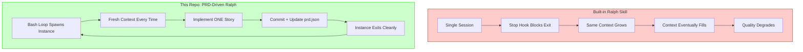
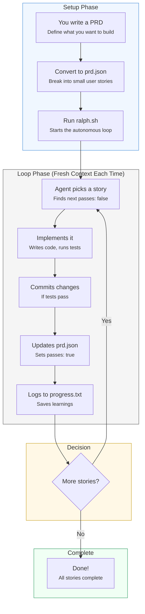
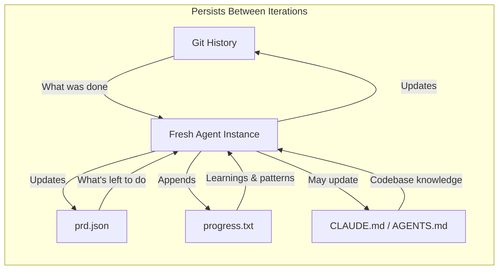
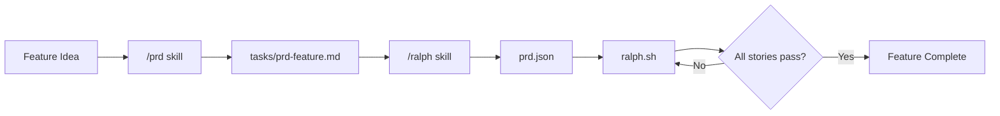

# Ralph


> "Ralph is a Bash loop." — [Geoffrey Huntley](https://ghuntley.com/ralph/), creator of the Ralph pattern

**The original, PRD-driven Ralph implementation.** Works with Claude Code CLI and OpenAI Codex. Converted from [Ryan Carson's Amp version](https://x.com/ryancarson/status/2008548371712135632).

This is **not** the built-in Claude Code ralph skill. This is a customizable, transparent implementation that gives you full control over the autonomous loop — the way Geoffrey Huntley intended.

---

## Table of Contents

- [Quick Start](#quick-start)
- [Step-by-Step Guide](#step-by-step-guide)
- [Why This Over the Built-in Skill?](#why-this-over-the-built-in-skill)
- [How It Works](#how-it-works)
- [The PRD Skills (Claude Code Only)](#the-prd-skills-claude-code-only)
- [Writing Good User Stories](#writing-good-user-stories)
- [Customization](#customization)
- [Debugging](#debugging)
- [Credits](#credits)

---

## Quick Start

```bash
# 1. Clone this repo
git clone https://github.com/jayozer/ralph.git
cd ralph

# 2. Copy files to your project
cp ralph.sh ralph-claude.sh prompt-claude.md prd.json.example /path/to/your-project/

# 3. In your project, create prd.json from the example
cd /path/to/your-project
cp prd.json.example prd.json
# Edit prd.json with your user stories

# 4. Run Ralph
./ralph.sh claude 10   # Claude Code with 10 iterations
./ralph.sh codex 10    # OpenAI Codex with 10 iterations
```

---

## Step-by-Step Guide

### Prerequisites

| Requirement | Installation |
|-------------|--------------|
| **Claude Code CLI** | [Install guide](https://docs.anthropic.com/en/docs/claude-code) |
| **OpenAI Codex CLI** (optional) | [Install guide](https://github.com/openai/codex) |
| **jq** | `brew install jq` (macOS) or `apt install jq` (Linux) |
| **Git repository** | Your project must be a git repo |

### Step 1: Get the Ralph Files

**Option A: Clone and copy**
```bash
git clone https://github.com/jayozer/ralph.git
cd ralph

# For Claude Code:
cp ralph.sh ralph-claude.sh prompt-claude.md prd.json.example /path/to/your-project/

# For OpenAI Codex:
cp ralph.sh ralph-codex.sh prompt-codex.md prd.json.example /path/to/your-project/

# For both engines:
cp ralph.sh ralph-claude.sh ralph-codex.sh prompt-claude.md prompt-codex.md prd.json.example /path/to/your-project/
```

**Option B: Download directly**
```bash
cd /path/to/your-project

# Core files (Claude Code)
curl -sLO https://raw.githubusercontent.com/jayozer/ralph/main/ralph.sh
curl -sLO https://raw.githubusercontent.com/jayozer/ralph/main/ralph-claude.sh
curl -sLO https://raw.githubusercontent.com/jayozer/ralph/main/prompt-claude.md
curl -sLO https://raw.githubusercontent.com/jayozer/ralph/main/prd.json.example

# Additional files for Codex (optional)
curl -sLO https://raw.githubusercontent.com/jayozer/ralph/main/ralph-codex.sh
curl -sLO https://raw.githubusercontent.com/jayozer/ralph/main/prompt-codex.md

chmod +x ralph*.sh
```

### Step 2: Create Your prd.json

Copy the example and edit it:

```bash
cp prd.json.example prd.json
```

**prd.json structure:**
```json
{
  "project": "MyApp",
  "branchName": "ralph/my-feature",
  "description": "Add user authentication",
  "userStories": [
    {
      "id": "US-001",
      "title": "Add users table",
      "description": "As a developer, I need a users table to store credentials.",
      "acceptanceCriteria": [
        "Create users table with id, email, password_hash",
        "Add migration file",
        "Typecheck passes"
      ],
      "priority": 1,
      "passes": false,
      "notes": ""
    },
    {
      "id": "US-002",
      "title": "Add login endpoint",
      "description": "As a user, I can log in with email and password.",
      "acceptanceCriteria": [
        "POST /api/login accepts email and password",
        "Returns JWT token on success",
        "Returns 401 on invalid credentials",
        "Typecheck passes"
      ],
      "priority": 2,
      "passes": false,
      "notes": ""
    }
  ]
}
```

**Key fields:**
- `branchName` — Ralph creates/uses this branch
- `priority` — Lower numbers run first (1, 2, 3...)
- `passes` — Set to `false`, Ralph sets to `true` when done
- `acceptanceCriteria` — Must be verifiable (always include "Typecheck passes")

### Step 3: Run Ralph

```bash
# Claude Code (default)
./ralph.sh 10              # 10 iterations
./ralph.sh claude 10       # Explicit: Claude Code

# OpenAI Codex
./ralph.sh codex 10        # 10 iterations with Codex
```

**What happens:**
1. Ralph creates/switches to the branch in `branchName`
2. Picks the highest-priority story where `passes: false`
3. Implements it, runs quality checks, commits
4. Updates `prd.json` to set `passes: true`
5. Logs learnings to `progress.txt`
6. Repeats until all stories pass or max iterations reached

### Step 4: Monitor Progress

```bash
# Watch stories complete
cat prd.json | jq '.userStories[] | {id, title, passes}'

# See learnings from iterations
cat progress.txt

# Check commits
git log --oneline -10
```

---

## Why This Over the Built-in Skill?

Geoffrey Huntley [explicitly stated](https://www.youtube.com/watch?v=O2bBWDoxO4s) that **"Claude Code's implementation isn't it."**



### The Critical Difference: Fresh Context

| Aspect | Built-in Skill | This Repo |
|--------|---------------|-----------|
| **Context per iteration** | Accumulates (same session) | Fresh (new instance) |
| **Memory model** | In-context (degrades over time) | External files (git, prd.json, progress.txt) |
| **Stop condition** | Hook blocks exit | `<promise>COMPLETE</promise>` signal |
| **Task structure** | Unstructured prompt | PRD with acceptance criteria |
| **Customization** | Limited | Full control via prompt files |
| **Progress visibility** | Opaque | `progress.txt` + `prd.json` status |
| **Learning persistence** | Lost when session ends | Saved to CLAUDE.md/AGENTS.md files |

---

## How It Works



### The Memory Model



---

## The PRD Skills (Claude Code Only)

Two optional skills help you create and convert PRDs. These are Claude Code specific.

### Install the Skills

```bash
# Global installation (available in all projects)
mkdir -p ~/.claude/skills
cp -r /path/to/ralph/.claude/skills/prd ~/.claude/skills/
cp -r /path/to/ralph/.claude/skills/ralph ~/.claude/skills/

# Or project-local installation
mkdir -p .claude/skills
cp -r /path/to/ralph/.claude/skills/* .claude/skills/
```

### Workflow



### `/prd` — Generate a PRD

```
/prd Add a task priority system with high/medium/low levels
```

Asks 3-5 clarifying questions, then generates a structured PRD in `tasks/prd-[feature-name].md`.

### `/ralph` — Convert PRD to JSON

```
/ralph convert tasks/prd-task-priority.md
```

Converts your PRD markdown to the `prd.json` format that Ralph executes.

---

## Writing Good User Stories

### Story Size: The #1 Rule

**Each story must be completable in ONE Ralph iteration (one context window).**

```
✅ Right-sized:                    ❌ Too big (split these):
─────────────────────────────────────────────────────────────
• Add a database column            • "Build entire dashboard"
• Add a UI component               • "Add authentication"
• Add a filter dropdown            • "Refactor the API"
• Update a server action
```

**Rule of thumb:** If you can't describe the change in 2-3 sentences, it's too big.

### Story Ordering: Dependencies First

| Priority | Type | Example |
|----------|------|---------|
| 1 | Schema/migrations | Add `priority` column to tasks table |
| 2 | Backend logic | Create server action for priority updates |
| 3 | UI components | Add priority badge to task cards |
| 4 | Aggregations | Add priority filter dropdown |

### Acceptance Criteria: Must Be Verifiable

```
✅ Good (verifiable):              ❌ Bad (vague):
─────────────────────────────────────────────────────────────
• Add status column with           • "Works correctly"
  default 'pending'
• Filter has options: All,         • "User can do X easily"
  Active, Completed
• Clicking delete shows            • "Good UX"
  confirmation dialog
• Typecheck passes                 • "Handles edge cases"
```

**Always include:**
- `"Typecheck passes"` — on every story
- `"Verify in browser"` — on UI stories

---

## Customization

### Edit Prompt Files

Every instruction Ralph follows is in `prompt-claude.md` (or `prompt-codex.md`). Add your project's requirements:

```markdown
## Quality Requirements

- ALL commits must pass `npm run typecheck`
- Run `npm test` before committing
- Use Tailwind for all styling
- Never modify files in `src/legacy/`
- Always use server actions, not API routes
```

### What You Control

| What | How |
|------|-----|
| **Quality gates** | Edit prompt files to require specific checks |
| **Story granularity** | Define exact acceptance criteria in `prd.json` |
| **Learning persistence** | `progress.txt` captures patterns across iterations |
| **Browser verification** | Add "Verify in browser" to UI story criteria |

---

## Debugging

```bash
# See which stories are done
cat prd.json | jq '.userStories[] | {id, title, passes}'

# See learnings from previous iterations
cat progress.txt

# Check git history
git log --oneline -10

# See current branch
git branch --show-current
```

---

## Key Files

| File | Purpose |
|------|---------|
| `ralph.sh` | Wrapper script — choose Claude Code or OpenAI Codex |
| `ralph-claude.sh` | Claude Code agent loop |
| `ralph-codex.sh` | OpenAI Codex agent loop |
| `prompt-claude.md` | Instructions for Claude iterations |
| `prompt-codex.md` | Instructions for Codex iterations |
| `prd.json` | User stories with acceptance criteria and `passes` status |
| `progress.txt` | Learnings that persist across iterations |
| `CLAUDE.md` | Project instructions for Claude Code |
| `AGENTS.md` | Project instructions for OpenAI Codex |
| `.claude/skills/` | Claude Code skills for PRD generation |

---

## Credits

- **[Geoffrey Huntley](https://ghuntley.com/ralph/)** — Created the Ralph pattern
- **[Ryan Carson](https://x.com/ryancarson)** — Original Amp implementation this repo is based on
- **[Claude Code](https://docs.anthropic.com/en/docs/claude-code)** — The AI that does the work
- **[OpenAI Codex](https://github.com/openai/codex)** — Alternative AI engine

---

## TL;DR

| If you want... | Use... |
|----------------|--------|
| Quick and dirty loop | Built-in skill |
| **Full control, fresh context, PRD-driven** | **This repo** |

---

*"That's the beauty of Ralph — the technique is deterministically bad in an undeterministic world."* — Geoffrey Huntley

*"Every failure leaves a breadcrumb. Every small commit adds a brick. Eventually, the breadcrumbs become a highway and the bricks become a cathedral. Ralph just keeps laying bricks."* — Jay Ozer
