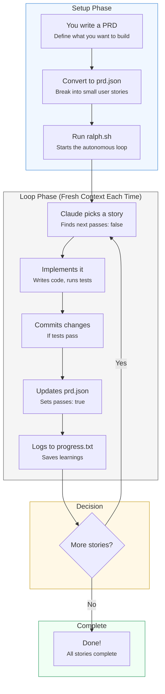
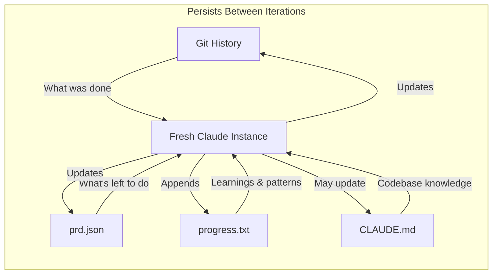
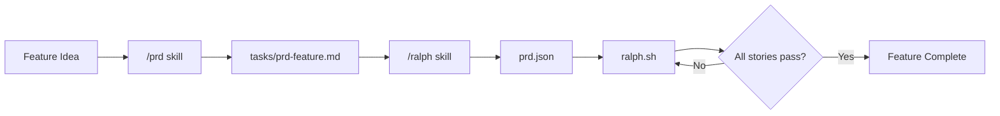
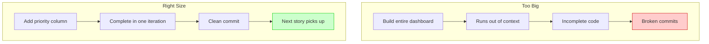

# Ralph


> "Ralph is a Bash loop." — [Geoffrey Huntley](https://ghuntley.com/ralph/), creator of the Ralph pattern

**The original, PRD-driven Ralph implementation for Claude Code.** Converted from [Ryan Carson's Amp version](https://x.com/ryancarson/status/2008548371712135632) to work with Claude Code CLI.

This is **not** the built-in Claude Code ralph skill. This is a customizable, transparent implementation that gives you full control over the autonomous loop — the way Geoffrey Huntley intended.

---

## Table of Contents

- [Why This Over the Built-in Skill?](#why-this-over-the-built-in-skill)
- [How It Works](#how-it-works)
- [Quick Start](#quick-start)
- [Using Ralph in an Existing Project](#using-ralph-in-an-existing-project)
- [The PRD Skills](#the-prd-skills)
- [Writing Good User Stories](#writing-good-user-stories)
- [Customization](#customization)
- [Debugging](#debugging)
- [Credits](#credits)

---

## Why This Over the Built-in Skill?

Geoffrey Huntley [explicitly stated](https://www.youtube.com/watch?v=O2bBWDoxO4s) that **"Claude Code's implementation isn't it."** Here's why this repo exists:

```mermaid
flowchart TB
    subgraph builtin["Built-in Ralph Skill"]
        B1[Single Claude Code Session] --> B2[Stop Hook Blocks Exit]
        B2 --> B3[Same Context Grows]
        B3 --> B4[Context Eventually Fills]
        B4 --> B5[Quality Degrades]
    end

    subgraph thisrepo["This Repo: PRD-Driven Ralph"]
        R1[Bash Loop Spawns Instance] --> R2[Fresh Context Every Time]
        R2 --> R3[Implement ONE Story]
        R3 --> R4[Commit + Update prd.json]
        R4 --> R5[Instance Exits Cleanly]
        R5 --> R1
    end

    style builtin fill:#ffcccc,stroke:#cc0000
    style thisrepo fill:#ccffcc,stroke:#00cc00
```



### The Critical Difference: Fresh Context

| Aspect | Built-in Skill | This Repo |
|--------|---------------|-----------|
| **Context per iteration** | Accumulates (same session) | Fresh (new instance) |
| **Memory model** | In-context (degrades over time) | External files (git, prd.json, progress.txt) |
| **Stop condition** | Hook blocks exit | `<promise>COMPLETE</promise>` signal |
| **Task structure** | Unstructured prompt | PRD with acceptance criteria |
| **Customization** | Limited | Full control via `prompt.md` |
| **Progress visibility** | Opaque | `progress.txt` + `prd.json` status |
| **Learning persistence** | Lost when session ends | Saved to `CLAUDE.md` files |

---

## How It Works



### The Memory Model

Unlike the built-in skill which relies on accumulated context, this implementation uses **external memory**:



### Session State Diagram

```
┌─────────────────────────────────────────────────────────────────────────────┐
│                           RALPH LIFECYCLE                                    │
└─────────────────────────────────────────────────────────────────────────────┘

  ┌──────────────┐
  │  You write   │
  │  prd.json    │
  └──────┬───────┘
         │
         ▼
┌─────────────────────────────────────────────────────────────────────────────┐
│  ralph.sh starts                                                            │
│  ┌─────────────────────────────────────────────────────────────────────┐   │
│  │ ITERATION 1                                                          │   │
│  │  ┌────────────────┐                                                  │   │
│  │  │ Fresh Claude   │──▶ Read prd.json ──▶ Find US-001 (passes:false) │   │
│  │  │ Code Instance  │                                                  │   │
│  │  └────────┬───────┘                                                  │   │
│  │           │                                                          │   │
│  │           ▼                                                          │   │
│  │  ┌────────────────┐   ┌────────────────┐   ┌────────────────┐       │   │
│  │  │ Implement      │──▶│ Run quality    │──▶│ git commit     │       │   │
│  │  │ story US-001   │   │ checks         │   │                │       │   │
│  │  └────────────────┘   └────────────────┘   └────────┬───────┘       │   │
│  │                                                      │               │   │
│  │           ┌──────────────────────────────────────────┘               │   │
│  │           ▼                                                          │   │
│  │  ┌────────────────┐   ┌────────────────┐                             │   │
│  │  │ Update prd.json│──▶│ Append to      │──▶ EXIT                    │   │
│  │  │ passes: true   │   │ progress.txt   │                             │   │
│  │  └────────────────┘   └────────────────┘                             │   │
│  └─────────────────────────────────────────────────────────────────────┘   │
│                                    │                                        │
│                     sleep 2s       │                                        │
│                                    ▼                                        │
│  ┌─────────────────────────────────────────────────────────────────────┐   │
│  │ ITERATION 2 (Fresh context!)                                         │   │
│  │  ┌────────────────┐                                                  │   │
│  │  │ Fresh Claude   │──▶ Read prd.json ──▶ Find US-002 (passes:false) │   │
│  │  │ Code Instance  │   Read progress.txt (learn from iteration 1)    │   │
│  │  └────────────────┘                                                  │   │
│  │           ... repeats same cycle ...                                 │   │
│  └─────────────────────────────────────────────────────────────────────┘   │
│                                    │                                        │
│                                    ▼                                        │
│                    (continues until all passes:true)                        │
│                                    │                                        │
│                                    ▼                                        │
│  ┌─────────────────────────────────────────────────────────────────────┐   │
│  │ FINAL ITERATION                                                      │   │
│  │  All stories have passes:true ──▶ Output: <promise>COMPLETE</promise>│   │
│  └─────────────────────────────────────────────────────────────────────┘   │
└─────────────────────────────────────────────────────────────────────────────┘
```

---

## Quick Start

### Prerequisites

- [Claude Code CLI](https://docs.anthropic.com/en/docs/claude-code) installed and authenticated
- `jq` installed (`brew install jq` on macOS)
- A git repository for your project

### 1. Copy to your project

```bash
mkdir -p scripts/ralph
curl -sL https://raw.githubusercontent.com/jayozer/ralph_code/main/ralph.sh > scripts/ralph/ralph.sh
curl -sL https://raw.githubusercontent.com/jayozer/ralph_code/main/prompt.md > scripts/ralph/prompt.md
chmod +x scripts/ralph/ralph.sh
```

### 2. Create a prd.json

```json
{
  "project": "MyApp",
  "branchName": "ralph/my-feature",
  "description": "Add user authentication",
  "userStories": [
    {
      "id": "US-001",
      "title": "Add users table",
      "description": "As a developer, I need a users table to store credentials.",
      "acceptanceCriteria": [
        "Create users table with id, email, password_hash",
        "Add migration file",
        "Typecheck passes"
      ],
      "priority": 1,
      "passes": false,
      "notes": ""
    }
  ]
}
```

### 3. Run Ralph

```bash
./scripts/ralph/ralph.sh 10  # Run up to 10 iterations
```

Ralph will autonomously implement each story, commit changes, and mark stories as complete.

---

## Using Ralph in an Existing Project

You **don't** need to start from this repo. Ralph is designed to be copied into any existing project.

### Option 1: Use the Portable Folder (Recommended)

This repo includes a `portable/` folder with everything you need:

```bash
# If you have this repo cloned locally
/path/to/ralph/portable/setup.sh

# Or copy the whole folder
cp -r /path/to/ralph/portable your-project/ralph
chmod +x your-project/ralph/ralph.sh
```

The portable folder includes:
- `ralph.sh` — The bash loop
- `prompt.md` — Instructions for Claude
- `prd.json.example` — Example PRD to copy
- `setup.sh` — One-command setup script
- `install-skills.sh` — Install `/prd` and `/ralph` skills globally
- `skills/` — The skill files for PRD generation

### Option 2: Download directly

```bash
# From your project root
mkdir -p scripts/ralph
curl -sL https://raw.githubusercontent.com/jayozer/ralph_code/main/ralph.sh > scripts/ralph/ralph.sh
curl -sL https://raw.githubusercontent.com/jayozer/ralph_code/main/prompt.md > scripts/ralph/prompt.md
curl -sL https://raw.githubusercontent.com/jayozer/ralph_code/main/prd.json.example > scripts/ralph/prd.json.example
chmod +x scripts/ralph/ralph.sh
```

### Project structure after setup

```
your-project/
├── ralph/
│   ├── ralph.sh       ← the bash loop
│   ├── prompt.md      ← instructions (customize this)
│   ├── prd.json       ← YOUR USER STORIES
│   └── progress.txt   ← auto-created on first run
├── src/
├── package.json
└── ...
```

---

## The PRD Skills

Two optional skills help you create and convert PRDs:

### Workflow Overview



### Install the Skills

```bash
mkdir -p ~/.claude/skills
cp -r .claude/skills/prd ~/.claude/skills/
cp -r .claude/skills/ralph ~/.claude/skills/
```

### Skill 1: `/prd` — Generate a PRD

Generates a structured Product Requirements Document through interactive Q&A.

**Usage:**
```
/prd Add a task priority system with high/medium/low levels
```

**What it does:**
1. Asks 3-5 clarifying questions with lettered options
2. Generates a structured PRD based on your answers
3. Saves to `tasks/prd-[feature-name].md`

**Example interaction:**
```
1. What is the primary goal of this feature?
   A. Help users focus on important tasks
   B. Enable team prioritization workflows
   C. Improve task sorting/filtering
   D. Other: [please specify]

2. Who is the target user?
   A. Individual users only
   B. Team members
   C. All users
   D. Admin users only
```

You can answer quickly: `1A, 2C`

**PRD sections generated:**
- Introduction/Overview
- Goals
- User Stories (with acceptance criteria)
- Functional Requirements (numbered)
- Non-Goals (out of scope)
- Technical Considerations
- Success Metrics
- Open Questions

### Skill 2: `/ralph` — Convert PRD to JSON

Converts PRD markdown to the `prd.json` format Ralph executes.

**Usage:**
```
/ralph convert tasks/prd-task-priority.md
```

**What it does:**
1. Reads the PRD markdown
2. Splits into small, implementable stories
3. Orders by dependency (schema → backend → UI)
4. Adds verification criteria
5. Saves to `prd.json`

**Key rules it follows:**
- Each story must fit in ONE context window
- Dependencies ordered correctly (database before API before UI)
- Every story includes "Typecheck passes"
- UI stories include "Verify in browser"

---

## Writing Good User Stories

### Story Size: The #1 Rule

**Each story must be completable in ONE Ralph iteration (one context window).**

```
✅ Right-sized:                    ❌ Too big (split these):
─────────────────────────────────────────────────────────────
• Add a database column            • "Build entire dashboard"
• Add a UI component               • "Add authentication"
• Add a filter dropdown            • "Refactor the API"
• Update a server action
```

**Rule of thumb:** If you can't describe the change in 2-3 sentences, it's too big.

### Story Ordering: Dependencies First

Stories execute in priority order. Earlier stories must not depend on later ones.

| Priority | Type | Example |
|----------|------|---------|
| 1 | Schema/migrations | Add `priority` column to tasks table |
| 2 | Backend logic | Create server action for priority updates |
| 3 | UI components | Add priority badge to task cards |
| 4 | Aggregations | Add priority filter dropdown |

### Acceptance Criteria: Must Be Verifiable

Each criterion must be something Ralph can CHECK, not something vague.

```
✅ Good (verifiable):              ❌ Bad (vague):
─────────────────────────────────────────────────────────────
• Add status column with           • "Works correctly"
  default 'pending'
• Filter has options: All,         • "User can do X easily"
  Active, Completed
• Clicking delete shows            • "Good UX"
  confirmation dialog
• Typecheck passes                 • "Handles edge cases"
```

**Always include these final criteria:**
- `"Typecheck passes"` — on every story
- `"Verify in browser"` — on UI stories

---

## Customization

### Edit `prompt.md` for Project-Specific Rules

Every instruction Ralph follows is in `prompt.md`. Add your project's requirements:

```markdown
## Quality Requirements

- ALL commits must pass `npm run typecheck`
- Run `npm test` before committing
- Use Tailwind for all styling
- Never modify files in `src/legacy/`
- Always use server actions, not API routes
```

### What You Control (That the Built-in Doesn't)

| What | How |
|------|-----|
| **Quality gates** | Edit `prompt.md` to require specific checks |
| **Story granularity** | Define exact acceptance criteria in `prd.json` |
| **Learning persistence** | `progress.txt` captures patterns across iterations |
| **Browser verification** | Add "Verify in browser" to UI story criteria |

---

## Debugging

```bash
# See which stories are done
cat prd.json | jq '.userStories[] | {id, title, passes}'

# See learnings from previous iterations
cat progress.txt

# Check git history
git log --oneline -10

# See current branch
git branch --show-current
```

### Archiving Previous Runs

Ralph automatically archives previous runs when you start a new feature:

```
archive/
  2026-01-15-task-priority/
    prd.json
    progress.txt
  2026-01-18-user-auth/
    prd.json
    progress.txt
```

---

## Key Files

| File | Purpose |
|------|---------|
| `ralph.sh` | The bash loop — spawns fresh Claude Code instances |
| `prompt.md` | Instructions for each iteration — **fully customizable** |
| `prd.json` | User stories with acceptance criteria and `passes` status |
| `progress.txt` | Learnings that persist across iterations |
| `portable/` | **Self-contained folder to copy to any project** |
| `.claude/skills/prd/` | Skill for generating PRDs |
| `.claude/skills/ralph/` | Skill for converting PRDs to JSON |

---

## Why Small Stories Matter

Each iteration runs in a fresh context. If a story is too big, Claude runs out of context before finishing:



---

## Comparison: Y Combinator Hackathon Results

At a YC hackathon, teams using the Ralph pattern [shipped 6 repos overnight](https://github.com/repomirrorhq/repomirror/blob/main/repomirror.md). One engineer reported completing a $50k contract for [$297 in API costs](https://x.com/GeoffreyHuntley/status/1943528204393955634).

The key? **Structured iteration with verifiable acceptance criteria** — exactly what this repo provides.

---

## Credits

- **[Geoffrey Huntley](https://ghuntley.com/ralph/)** — Created the Ralph pattern
- **[Ryan Carson](https://x.com/ryancarson)** — Original Amp implementation this repo is based on
- **[Claude Code](https://docs.anthropic.com/en/docs/claude-code)** — The AI that does the work

---

## TL;DR

| If you want... | Use... |
|----------------|--------|
| Quick and dirty loop | Built-in skill |
| **Full control, fresh context, PRD-driven, persistent learning** | **This repo** |

---

*"That's the beauty of Ralph — the technique is deterministically bad in an undeterministic world."* — Geoffrey Huntley

*"Every failure leaves a breadcrumb. Every small commit adds a brick. Eventually, the breadcrumbs become a highway and the bricks become a cathedral. Ralph just keeps laying bricks."* — Jay Ozer
